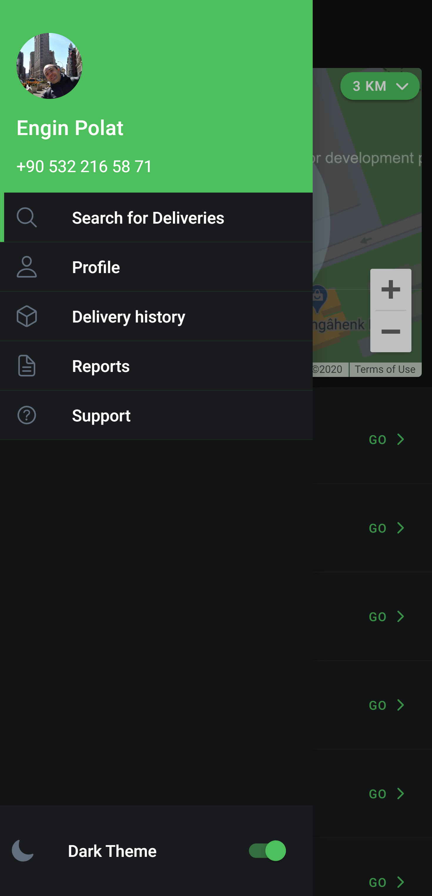

# GrowCherry application (Fast and local groceries delivery)

This is the **GrowCherry** project from [Hackorona - Creativity will not be quarantined](https://hackorona.in.dev/) Hackathon

## Problem

The coronavirus pandemic created new restrictions that grocery stores and Supermarkets  have to work under pressure : In Israel, a business must not hold more than 10 customers within the same store.

* Due to these new restrictions a large number of customers went through to place food orders through digital platforms, but find it hard to use, especially for elderly.

* Many Grocery stores are unable to accept multiple orders at the same time, and hold a small number of delivery workers. Which leads to high orders delays in deliveries

* At the same time, Local grocery stores are losing their customers because of their inability to make deliveries

## Solution

GrowCherry created a network for Grocery stores that allows customers to shop online in the most  accessible way for elderly and whom can’t leave their homes. Our Network create job opportunities for individuals, while giving local stores the ability to make deliveries using outsource delivery services.

Locally customized a global solution

We at GrowCherry see this opportunity to impact a global problem with a unique local customized solution . By creating a local solution we will create on-going global solution to one of the main problems humanity needs to deal with in times of social distancing, quarantine and movement restrictions.

## Presentation

You can find the _Team Presentation_ below

[](./assets/growcherry.pptx)

## Projects

There are 2 projects in this repo, `courier` (Mobile app project), `mock-api` (Mock Backend project)

* `mock-api`: This project uses `json-server` npm package to generate mock api which returns `json` output. Also it has `faker` npm package to generate real-looking data, such as, first name, last name, product name, location, address, etc.

* `courier`: This project uses `ionic` to build an _IOS_ and _Android_ apps for elderly people. Underlyingly this project uses `angular` with `typescript` and `sass`

## Guideline

Here is the guideline to run the project on your machine;

* Clone the project by running the following command on your _Terminal_

```bash
git clone https://github.com/polatengin/bern.git
```

* Go to `src/mock-api` folder and install `npm` dependencies by running the following command on your _Terminal_

```bash
cd src/mock-api
npm i
```

* Go to `src/courier` folder and install `npm` dependencies by running the following command on your _Terminal_

```bash
cd src/courier
npm i
```

* Run the _Mock Backend_ project first

```bash
cd src/mock-api
npm run start
```

* Run the _Courier_ project

```bash
cd src/courier
npm run start
```

## Screens

When you first run the `courier` project, it redirects to _SignUp_ page


You can go to _Login_ page by clicking _Sign In_ link at the bottom


When you _SignUp_ or _Login_ if there is an error, you'll see a notification at the top of your screen


If everything is OK, then your account is created and app redirected to _Verify_ page


When you _verify_ your pin with the message sent from the system, you'll be redirected to the _Main Page_

_Sending pin notification is not implemented yet, entering 4 numbers is enough to verify yourself_


On the _Main Page_ you'll find deliveries waiting for couriers. List of deliveries are gathered around your location. If you want to expand or narrow the list, you can change the _range_

Valid values are; _1 KM_, _3 KM_, _5 KM_, _10 KM_, _any_


If you click the _menu_ button on the _Main Page_ you can see the current account and other options of the app.


Also, you can change the theme to _Dark_.



You can continue to use the app in _Dark Mode_


If you want to list the deliveries of another location, you can search for an address.

You can see your _current_ address and search for _another_ address in the _Set your location_ page.


When you select _another_ address, _Main Page_ will list deliveries around the _selected_ address.


When you click _Go >_ button, you'll be redirected to _Delivery Details_ page.


You can see the _Starting Point_, _Location of the supermarket_ and _Delivery Point_.

Mostly, starting point is your _current location_.

To start the process, you'll click _Go >_ button at the bottom of the screen.

You'll see _your location_ section is lit green and app is waiting for you to arrive to the supermarket.


When you arrive to supermarket, you'll click _Report Arrival_ button at the bottom of the screen.

App will lit _supermarket location_ section green and it'll wait you to start collecting shopping items.


When you click _Order list_ button at the bottom of the screen, you'll be redirected to _Order list_ page.


You can set collected item's checkboxes manually, or you can launch barcode scanner and scan the items barcode. App will set the item's checkbox automatically.

_Scanning a barcode functionality is done, but it requires an actual device to scan a barcode, it isn't possible to scan a barcode if you're using an emulator_


When you collect _every_ item in the _oder list_ you need to click _Done_ button at the top of the screen.


You'll be redirected to _Delivery Details_ page and _delivery location_ section will be lit green.

When you actually delivered the items, then you'll click _Delivery finished_ button at the bottom of the screen.

App will redirect you to the _Main Page_.


